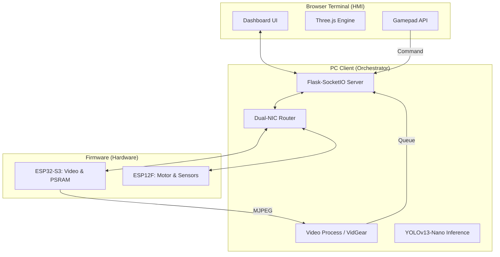

# 專案詳細技術說明書與演示腳本 (Detailed Technical Manual & Script)

本檔案為 `FULL_PROJECT_PRESENTATION.md` 的深度擴展版，旨在為 10 分鐘的報告提供充足的細節支撐。

---

## 🏗️ 系統全景架構圖 (System Architecture)

---

## 📄 第一段：韌體優化細節 (Firmware Deep-Dive)

### 1.1 關於「低延遲 Wi-Fi」的實現
**演示腳本:**
> 「在開發初期，我們發現指令發送後機器人反應會有『黏滯感』。經排查，這是因為 ESP32 預設會進入 Modem-sleep。我們修改了 `wifi_sta.c`，透過 `esp_wifi_set_ps(WIFI_PS_NONE)` 徹底釋放了射頻效能。現在，每一條運動指令都能在 20ms 內被解析。」

### 1.2 馬達控制中的「加速度斜坡」
**技術細節:**
在 `app_motor.c` 中，我們不直接將 PWM 設為目標值，而是通過一個 10ms 的計時器任務：
- **緩升 (Ramping Up):** 避免啟動瞬間的大電流拉低系統電壓。
- **緩降 (Ramping Down):** 減少齒輪箱的機械衝擊。
- **補償:** 針對平行連桿機構實施了幾何上的耦合補償。

---

## 📑 第二段：PC 客戶端優化細節 (PC Client Deep-Dive)

### 2.1 影音分離與多進程優化
**演示腳本:**
> 「Python 的 GIL (全域解釋器鎖) 限制了高頻控制與 AI 偵測的併行。我們將影像處理拆分到 `video_process.py`，並使用 `Multiprocessing.Queue` 進行跨進程通訊，這確保了 UI 控制線程永遠不會被耗時的 AI 運算卡住。」

### 2.2 VidGear 的實作優勢
- **自動連接:** 當 ESP32 因電源不穩重新啟動時，VidGear 會自動偵測並恢復流，無需重新開啟網頁。
- **效能:** 通過 OpenCV 的底層優化減少了解碼延遲。

---

## 📊 第三段：瀏覽器端優化細節 (Browser Deep-Dive)

### 3.1 Three.js 數位雙生與同步
**演示腳本:**
> 「為了解決操作者無法看到機器人死角的問題，我們在瀏覽器端開發了數位雙生視圖。當實體馬達轉動時，瀏覽器會同步計算運動學方程，並在 3D 模型上即時更新位置。」

### 3.2 運動學補償邏輯 (Kinematics Compensation)
由於機械手臂 Mk1 採用了平行連桿設計，中間關節的運動會帶動末端高度變化。我們在 `static/js/robot_arm.js` 中實作了補償算法，使得使用者在垂直平面移動時，手臂能自動修正常連桿角度。

---

## ❓ 常見問答準備 (Q&A Preparation)

**Q1：為什麼不使用單一晶片 (如 ESP32-S3) 同時處理影像與馬達？**
**答：** 我們的測試顯示，當 ESP32-S3 進行高性能影像編碼與傳輸時，其 GPIO 中斷響應會受到干擾。採用雙晶片架構能有效隔絕「計算密集型」與「即時控制型」任務。

**Q2：如何應對戶外環境的 Wi-Fi 干擾？**
**答：** 除了 `WIFI_PS_NONE` 優化，我們在韌體中加入了通訊校驗與逾時自動停機機制（Watchdog），確保在訊號中斷時機器人會立即停止，防止失控。

---
*詳細數據與代碼對映請參閱 `Docs/CODE_MAPPING.md`*
