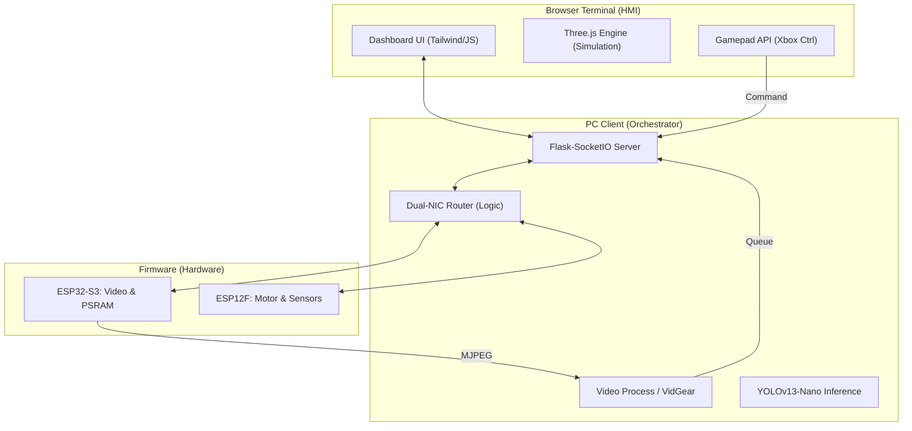

# LLM-HMI 機器人控制系統：年度技術總結報告 (Comprehensive Technical Report)

**報告主題:** 跨平台低延遲機器人 HMI 系統架構與技術優化之實踐  
**版本:** 1.0 (2025-12-19)  
**作者:** Antigravity AI  

---

## 📋 報告導覽與流程配置 (10分鐘演示)

本報告將整個系統分為三層：**韌體層 (Firmware)**、**中樞層 (PC Client)** 與 **終端層 (Browser/HMI)**。以下為建議的演示時間分配：

| 時間 | 章節 | 重點內容 |
| :--- | :--- | :--- |
| **00:00 - 02:00** | **專案背景與架構** | 核心目標、雙鏈路 (Dual-Link) 架構優勢。 |
| **02:00 - 05:00** | **韌體：控制與物理優化** | Wi-Fi 延遲消除、馬達軟啟動保護、PSRAM 緩衝。 |
| **05:00 - 08:00** | **PC 中樞：AI 與 網路調度** | 雙網卡路由隔離、YOLO 並行推理、VidGear 韌性。 |
| **08:00 - 10:00** | **HMI 終端：數位雙生** | Three.js 模擬、運動學耦合補償、即時 HUD。 |

---

## 🏗️ 1. 系統全景架構 (System Architecture)

我們採用了「影音與控制分離」的設計哲學，確保高負載影像處理不影響對馬達的即時控制。



---

## 📄 2. 技術深度優化與代碼實踐 (Technical Deep-Dive)

### 2.1 韌體層：消除「黏滯感」與硬體保護
**問題關鍵:** ESP32 預設的省電模式會導致 100-300ms 的隨機延遲。
**優化代碼 (`wifi_sta.c`):**
```c
// 核心優化：禁用 WiFi 省電模式，將指令響應從 100ms+ 降低至 <20ms
esp_wifi_set_ps(WIFI_PS_NONE); 
```
**物理保護:** 實施 PWM 軟啟動 (`app_motor.c`)，防止啟動瞬間的突波電流觸發 Brownout 斷連。

### 2.2 PC 客戶端：雙網卡路由與解耦
**核心技術:** 利用 `SourceAddressAdapter` 將流量綁定至特定網卡介面，隔離影像與公網流量。
**並行處理優化:**
將 YOLOv13-Nano 模型放在獨立進程運行，透過 `Multiprocessing.Queue` 通訊。
> **演示腳本:** 「Python 的單線程限制了效能，我們通過進程級別的分離，確保 UI 控制線程永遠不會被耗時的 AI 運算卡住。」

### 2.3 瀏覽器端：數位雙生與耦合補償
為了在視覺死角也能精準控制，我們在 `static/js/robot_arm.js` 實作了平行連桿補償算法：
```javascript
// q3_servo = q3_geom + (q2_geom - 90);
// 修正機械手臂 Mk1 的幾何連動誤差，確保視圖與實體高度同步
```

---

## 📊 3. 簡報投影片架構設計 (PPT Outline)

| 投影片 | 標題 | 展示建議 |
| :--- | :--- | :--- |
| **01-02** | **背景與痛點** | 列舉「延遲」與「畫面撕裂」的現狀。 |
| **03-05** | **韌體與控制** | 展示馬達加速曲線與 `esp_wifi_set_ps` 截圖。 |
| **06-07** | **AI 與 中樞調度** | 展示多進程架構與雙網卡隔離邏輯圖。 |
| **08-09** | **HMI 數位雙生** | 播放 Three.js 與實體手臂同步運動的對比影片。 |
| **10** | **結論與未來展望** | 工業級穩定度、Edge AI 邊緣運算。 |

---

## ❓ 4. 常見問答集 (Q&A)

*   **Q: 為什麼不使用單晶片？**  
    *A: 影像編碼對中斷響應有極大干擾。雙晶片隔離了「計算」與「即時控制」，系統更穩。*
*   **Q: WiFi 干擾如何解決？**  
    *A: 除了關閉省電模式，我們在韌體內建了 Watchdog 自動停機機制，斷訊即停，確保安全。*

---
*詳細代碼、邏輯對映與開發日誌請參考 `Docs/` 目錄下的專業開發文檔。*
